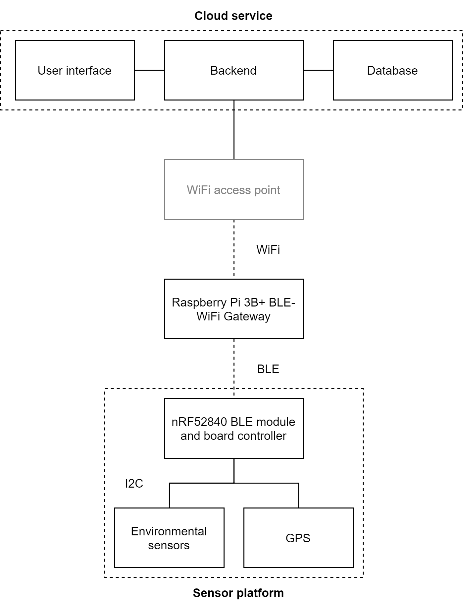

# SlumSense
A simple IoT solution comprising of a BLE sensor, sensor gateway and a cloud service.

## BLE Peripheral (SlumSense)

Contains the project files and code for the BLE peripheral that is the actual IoT sensor.

## Gateway (SlumWay)

Contains the project files and code fot the gateway software. The gateway runs on Linux Raspbian (Raspberry Pi 3B+).

It is a python client that asks (or just reads) data from the BLE peripheral and sends it to the cloud using a REST API.

# Cloud Service (SlumCloud)

Contains the project files and code fot the cloud service software. It runs in a Linux Ubuntu server (AWS EC2).

Its main purpose is to offer a REST API for the gateway(s) to use for saving sensor data. The server stores the data to a MySQL database and also offers a browser-based user interface for monitoring the devices and analyzing the data.

**High-level diagram of the system:**

